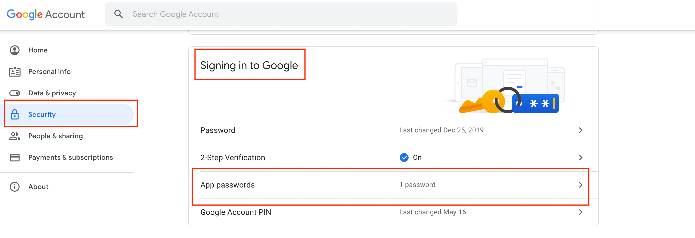
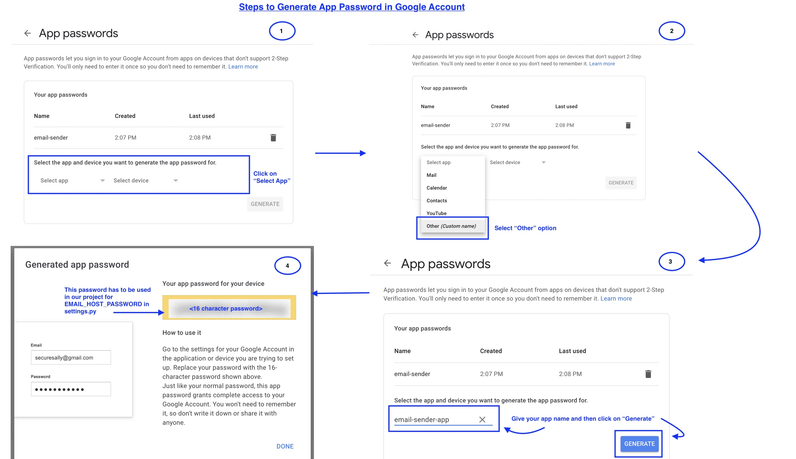

# Django-Email-Yuboruvchi
HTML shabloni yordamida Gmail orqali Django-dan email yuborish.

## Oldindan talab qilinadigan dasturlar
- Python 3.8
- Pip
- Git

## Ishga tushirish bosqichlari:

1. **Loyihani klonlash:**
   Quyidagi buyruq yordamida loyihani klonlang:
   ```bash
   git clone https://github.com/sukanya-pai/Django-Email-Sender.git
   ```

2. **Virtual muhit yaratish va o‘rnatish:**
   - `PipFile` ichida kerakli kutubxonalar ko‘rsatilgan. Kutubxona ziddiyatlarini oldini olish uchun virtual muhitda ishlash tavsiya etiladi.
     ```bash
     pip install pipenv
     pipenv shell
     pipenv install
     ```

3. **Serverni ishga tushirish:**
   ```bash
   python email_project/manage.py runserver
   ```
   Keyin [http://127.0.0.1:8000/api/send-mail](http://127.0.0.1:8000/api/send-mail) havolasini oching.

4. **`views.py` faylida o‘zgarishlar kiriting:**
   - **`email_sender_app` papkasidagi `views.py`** faylidan `send_mail()` metodini toping va unda quyidagi ma'lumotlarni yangilang:
     - O‘z email manzilingiz
     - Qabul qiluvchining email manzili.

5. **`settings.py` faylida o‘zgarishlar kiriting:**
   - **`email_project` papkasidagi `settings.py`** faylidan quyidagi o‘zgarishlarni bajaring:
     - Gmail email manzilingiz va App Password qo‘shing.
     ```python
     EMAIL_HOST_USER = 'your-email@gmail.com'
     EMAIL_HOST_PASSWORD = 'your-app-password'
     ```
     - Ushbu loyiha namuna sifatida tayyorlanganligi sababli, App Password bevosita `settings.py` faylida yozilgan. **Xavfsizlik sababli**, ushbu ma'lumotni shifrlash yoki maxfiy kalitlarda saqlash tavsiya etiladi.

6. **Host Gmail akkauntidagi majburiy sozlamalar:**
   - [https://myaccount.google.com/security](https://myaccount.google.com/security) sahifasiga o‘ting.
   - **"Signing in to Google"** bo‘limini toping:
     - **"App Passwords"** opsiyasini tanlang. Quyidagi suratga qarang:
     
       
       
     - Akkaunt parolingizni kiriting va quyidagi bosqichlarga amal qiling:
       
       

   - Yuqoridagi bosqichlarni bajarishingiz orqali Django loyihangiz Gmail akkauntidan email yuboradi.

## O‘zgarishlar tarixi
- [change log](change.log) sahifasini o‘qing.
